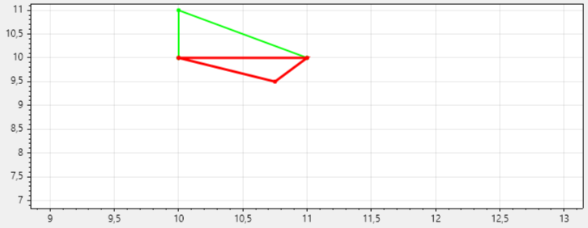
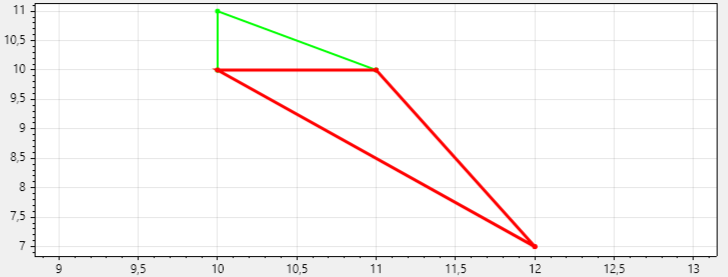
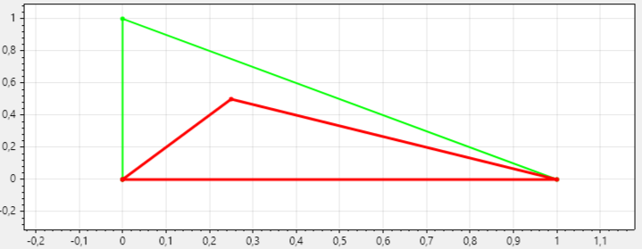
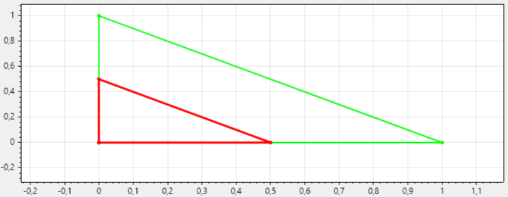
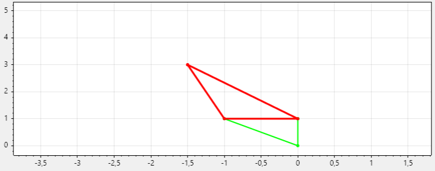
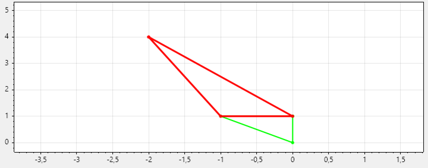
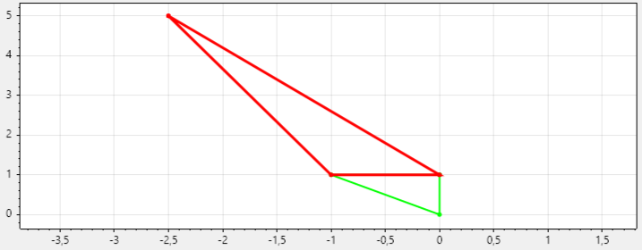
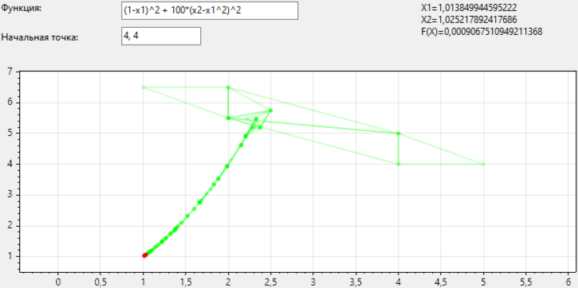
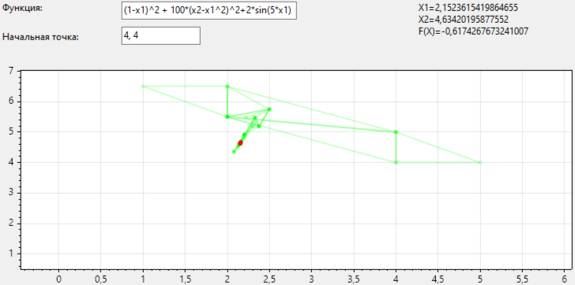

# Метод Нелдера-Мида
## Комманда:
- Мастюгин Михаил
- Федоров Артем
- Иванов Семен
## Отражение (α=1.0)
Алгоритм находит новую точку, отражая наихудшую точку симплекса относительно центра тяжести остальных точек.
 - α>1: точка отразится дальше от центра, что ускорит исследование пространства, но может привести к пропуску хорошей области.
 - α<1: точка отразится ближе к центру, что сделает поиск более осторожным, но медленным.

| α=0.5 | α=1.0 | α=1.5 |
|------------|------------|------------|
|  |  |  |

## Сжатие (β=0.5)
Если отраженная точка не улучшила ситуацию, алгоритм сжимает симплекс в направлении центра.
 - β>0.5: симплекс сожмётся сильнее, что может ускорить локализацию минимума, но повысит риск дегенерирования симплекса.
 - β<0.5: сжатие будет слабее, что сделает поиск более плавным, но медленным.

| β=0.3 | β=0.5 | β=1.0 |
|------------|------------|------------|
|  |  |  |

## Растяжение (γ=2.0)
Если отраженная точка оказалась лучше всех, алгоритм пытается растянуть симплекс дальше в этом направлении, чтобы ускорить сходимость.
 - γ>2: симплекс будет растягиваться сильнее, что может ускорить сходимость, но повысит риск пропустить минимум.
 - γ<2: растяжение будет менее агрессивным, что сделает поиск устойчивее, но медленнее.

| γ=2.0 | γ=3.0 | γ=4.0 |
|------------|------------|------------|
|  |  |  |

## Наличие локальных минимумов
Как и большинство методов нулевого порядка, Нелдер-Мид легко застревает в локальных минимумах.
Рассмотрим функцию Розенброка.

В этом случае алгоритм из начальной точки `(4,4)` находит минимум в точке `(1,1)`. Теперь модифицируем функцию, добавив член `2*sin(5*x1)`, который вносит бесконечное число локальных экстремумов.

Теперь из той же самой начальной точки метод остановился в локальном минимуме, не сумев из него выбраться.

## Вычислительный эксперимент
Возьмем четыре набора параметров `(α,β,γ)` и проведем вычислительные эксперименты на четырех тестовых функциях, стартуя из начальной точки `(10,10)`. Измерим количество шагов, необходимое алгоритму для достижения минимума с заданной точностью.

| Функция | `(1.0,0.5,2.0)` | `(1.5,0.3,2.5)` | `(0.8,0.7,1.5)` | `(1.2,0.4,3.0)` |
|------------|------------|------------|------------|------------|
| Матьяса | 19 | 24 | 28 | 22 | 23 |
| Розенброка | 109 | не достигла минимума | не достигла минимума | 122 |
| Химмельблау | 25 | 33 | 45 | 35 |
| Парабалоид | 22 | 31 | 35 | 24 |

Набор из стандартных значений показал наилучшие результаты.

# Выводы
## 1. Оптимальные параметры
- Стандартные значения коэффициентов (α=1.0, β=0.5, γ=2.0) демонстрируют наиболее сбалансированную работу:
- Отражение (α=1.0): Обеспечивает разумный компромисс между скоростью исследования и устойчивостью.
- Сжатие (β=0.5): Предотвращает излишнее сжатие симплекса, сохраняя его геометрическую устойчивость.
- Растяжение (γ=2.0): Позволяет ускорить сходимость в удачных направлениях без риска "перелета" минимума.
### Результаты:
- Наименьшее число итераций для функций Матьяса, Химмельблау и параболоида.
- Успешное достижение минимума для Розенброка (в отличие от других наборов).
## 2. Чувствительность к параметрам
- Агрессивные параметры (например, α=1.5, γ=3.0) могут ускорить поиск на простых функциях (параболоид), но приводят к пропуску минимума (Розенброк), дегенерации симплекса (из-за чрезмерного растяжения/сжатия).
- Консервативные параметры (например, α=0.8, γ=1.5) увеличивают число итераций (Химмельблау: 45 vs 25), снижают риск "застревания", но не гарантируют успеха (Розенброк).
## 3. Проблема локальных минимумов
Метод крайне чувствителен к наличию локальных экстремумов:
- Пример с модифицированной функцией Розенброка (2sin(5x1)):
- Алгоритм застревает в первом же локальном минимуме.
- Даже оптимальные параметры не спасают — требуется модификация метода (например, повторные запуски из разных точек).
### Вывод:
Метод Нелдера-Мида не подходит для задач с множеством локальных минимумов без дополнительных модификаций.
## 4. Зависимость от формы функции
- Хорошая работа: На гладких, выпуклых или слабо овражных функциях (Матьяса, параболоид).
- Плохая работа: На функциях с оврагами (Розенброк) или осцилляциями (sin-модификации).

