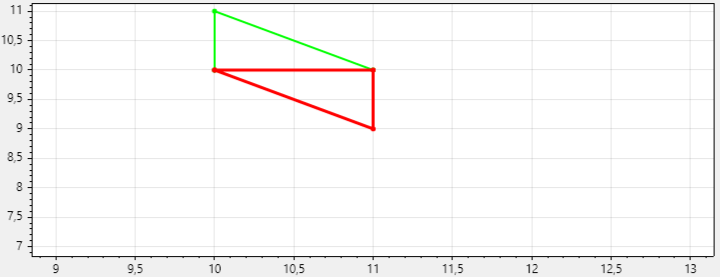
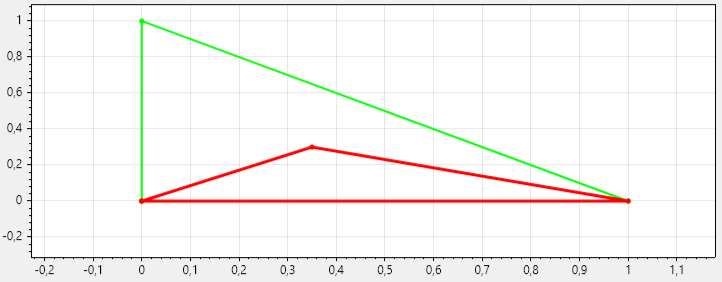

# Метод Нелдера-Мида
## Отражение (α=1.0)
Алгоритм находит новую точку, отражая наихудшую точку симплекса относительно центра тяжести остальных точек.
 - α>1: точка отразится дальше от центра, что ускорит исследование пространства, но может привести к пропуску хорошей области.
 - α<1: точка отразится ближе к центру, что сделает поиск более осторожным, но медленным.

| α=0.5 | α=1.0 | α=1.5 |
|------------|------------|------------|
|  |  |  |

## Сжатие (β=0.5)
Если отраженная точка не улучшила ситуацию, алгоритм сжимает симплекс в направлении центра.
 - β>0.5: симплекс сожмётся сильнее, что может ускорить локализацию минимума, но повысит риск дегенерирования симплекса.
 - β<0.5: сжатие будет слабее, что сделает поиск более плавным, но медленным.

| β=0.3 | β=0.5 | β=1.0 |
|------------|------------|------------|
|  |  |  |

## Растяжение (γ=2.0)
Если отраженная точка оказалась лучше всех, алгоритм пытается растянуть симплекс дальше в этом направлении, чтобы ускорить сходимость.
 - γ>2: симплекс будет растягиваться сильнее, что может ускорить сходимость, но повысит риск пропустить минимум.
 - γ<2: растяжение будет менее агрессивным, что сделает поиск устойчивее, но медленнее.

| γ=2.0 | γ=3.0 | γ=4.0 |
|------------|------------|------------|
|  |  |  |

## Наличие множества локальных минимумов
Как и большинство методов нулевого порядка, Нелдер-Мид легко застревает в локальных минимумах.
Рассмотрим функцию Розенброка.

В этом случае алгоритм из начальной точки `(4,4)` находит минимум в точке `(1,1)`. Теперь модифицируем функцию, добавив член `2*sin(5*x1)`, который вносит бесконечное число локальных экстремумов.

Теперь из той же самой начальной точки метод остановился в локальном минимуме, не сумев из него выбраться.